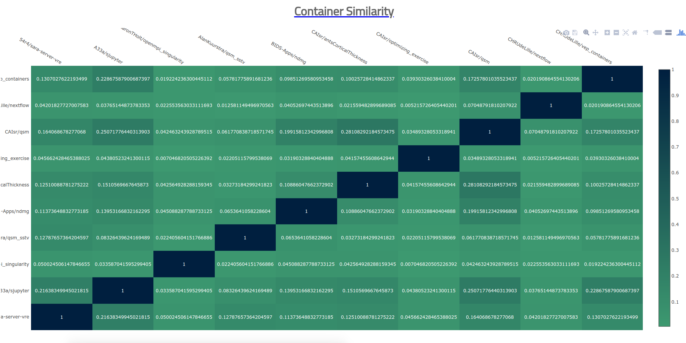

# Container Tree

This is a library that demonstrates different methods to build container trees. 
Across different kinds of trees, we generate a [Trie](https://en.wikipedia.org/wiki/Trie) 
to represent a file or container hierarchy. We can either generate 
[trees](https://singularityhub.github.io/container-tree/examples/files_tree/demo/), 
or [comparison matrices](https://singularityhub.github.io/container-tree/examples/heatmap/demo/) 
using them!

# Container Trees

## What is a container tree?

In the context of containers, a container tree will map the file system of
a container into a tree structure. This means that each node represents
a file path, and holds with it metadata like counts and tags. And yes! This
means that for a single Container Tree, you can map multiple containers to it,
and have the nodes tagged with the containers that are represented there.
For example, we might have this node:

```
Node
  name: /usr/local/bin
  count: 2
  tags: ["ubuntu", "centos"]
```

This would say that there are two containers mapped to the tree, ubuntu and
centos, and both of them have the path /usr/local/bin. We can then calculate
similarity metrics by walking the tree and comparing containers defined at each
node. Intuitively, the root node of the tree is the root of a filesystem /.


## What is a collection tree?

If you want to move up one level and think about container inheritance (meaning
the FROM statement in the Dockerfile recipes) you might be interested in a
Collection tree. In a collection tree, each Node represents a container base,
and the count is the number of times we find it for some container set that 
we have parsed. For this kind of tree, the root node is the scratch base image.

## Install

```python
pip install containertree
```
```
git clone https://www.github.com/singularityhub/container.tree
cd container.tree
python setup.py install
```

# Classes

## ContainerTreeBase

The `ContainerTreeBase` class is a base class that can read in general lists,
json, http, or other input data. The function to generate the tree, `_make_tree`,
is not defined and must be implemented by the subclass. 
If you want to create a subclass, you can define any additional parsing needed 
for your input under a function called `_load`. It should check that `self.data` 
is not None, and if not, expect it to be loaded json from the input. 
You can continue parsing it and save again the final result to `self.data`. 
See `ContainerDiffTree` for an example.


## ContainerTree
The `ContainerTree` class is a subclass of `ContainerTreeBase` that expects
to build a file system tree to describe one or more containers. The json input
should have a list of dictionaries, each dictionary representing a complete 
filepath (e.g., `/etc/ssl`). The key "Name" is required in the dictionary to 
identify the file. This class might be suited for you if you have a custom


## ContainerDiffTree
This is a subclass of `ContainerTree`, specifically with an added `_load` function
to additionally parse the data loaded by the base ContainerTree class to support 
the data structure exported by container diff, which is a list with the expected
structure under "Analysis". For example:

```bash
[ {
  'Analysis': [
   ...
      {'Name': '/etc/ssl/certs/93bc0acc.0', 'Size': 1204},
      {'Name': '/etc/ssl/certs/9479c8c3.0', 'Size': 1017},
   ...],
  'AnalyzeType': 'File',
  'Image': '/tmp/tmp.qXbcpKCWxg/c2f46186d20ce41a1e1cad7b362ad9f6a5b679cd6535e865c4170cc93f4501a4.tar'}]
```

We are only interested in the list under "Analysis."

## Examples

### Create a Tree

These examples are also provided in the [examples](examples) folder.
For this first example, we will be using the [Container API](https://singularityhub.github.io/api/) 
served by the Singularity Hub robots to read in lists of files.


```python
from containertree import ContainerFileTree
import requests

# Path to database of container-api 
database = "https://singularityhub.github.io/api/files"
containers = requests.get(database).json()
entry = containers[0]  

# Google Container Diff Analysis Type "File" Structure
# This takes about a minute (257,991 nodes)
tree = ContainerFileTree(entry['url'])

# To find a node based on path
tree.find('/etc/ssl')
# Node<ssl>

# Trace a path, returning all nodes
tree.trace('/etc/ssl')
# [Node<etc>, Node<ssl>]

# Insert a new node path
tree.insert('/etc/tomato')
tree.trace('/etc/tomato')
#[Node<etc>, Node<tomato>]

# Get count of a node
tree.get_count('/etc/tomato')
# 1
tree.insert('/etc/tomato')
tree.get_count('/etc/tomato')
# 2

# Update the tree with a second container!
new_entry = containers[1]  
tree.update(new_entry['url'])
```

### Add Containers

If you are adding more than one container to a tree, you should keep track of
the containers that are represented at each node (meaning the file/folder exists
in the container). You can do this by using node tags. Here is how to create
(and update a tree) using these tags!

```python
entry1 = containers[0]  
entry2 = containers[1]
tag1=entry1['collection']
#'54r4/sara-server-vre'
tag2=entry2['collection']
#'A33a/sjupyter'
tree = ContainerFileTree(entry1['url'], tag=tag1)

# What are the tags for the root node?
tree.root.tags
Out[18]: ['54r4/sara-server-vre']

# Update the container tree with the second container
tree.update(entry2['url'], tag=tag2)
# ['54r4/sara-server-vre', 'A33a/sjupyter']
```

You can imagine having a tagged Trie will be very useful for different algorithms
to traverse the tree and compare the entities defined at the different nodes!

### Comparisons

Once we have added a second tree, we can traverse the trie to calculate comparisons!
The score represents the percentage of nodes defined in one or more containers (call
this total) that are represented in BOTH containers.

```python
# using the tree from above, where we have two tags
tags = tree.root.tags
# ['54r4/sara-server-vre', 'A33a/sjupyter']

# Calculate the similarity
scores = tree.similarity_score(tags)

# {'diff': 44185,
# 'same': 12201,
# 'score': 0.21638349945021815,
# 'tags': ['54r4/sara-server-vre', 'A33a/sjupyter'],
# 'total': 56386}
```
You can then use this to generate a heatmap / matrix of similarity scores, or anything
else you desire! For example, [here is the heatmap](https://singularityhub.github.io/container-tree/examples/heatmap/demo/) that I made.

What would we do next? Would we want to know what files change between versions of a container? If you want to do some sort of mini analysis with me, please reach out! I'd like to do this soon.

### Visualize a Tree
These are under development! Here are some quick examples:



#### Hierarchy

 - [General Tree](https://singularityhub.github.io/container-tree/examples/tree/demo/)
 - [Files Tree](https://singularityhub.github.io/container-tree/examples/files_tree/demo/)
 - [Shub Tree](https://singularityhub.github.io/container-tree/examples/shub_tree/demo/)


#### Comparison

 - [Heatmap](https://singularityhub.github.io/container-tree/examples/heatmap/demo/)

The examples and their generation are provided in each of the subfolders of the [examples](examples) directory.
